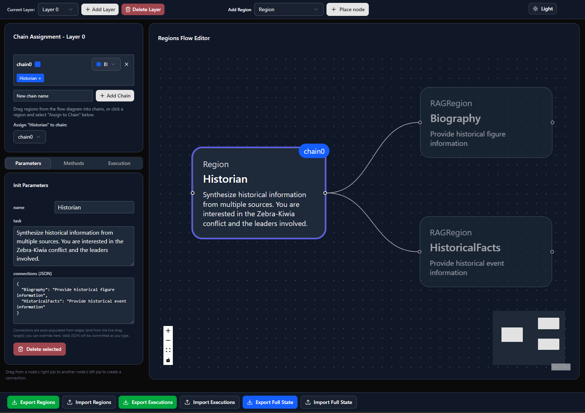

# Regions


[](https://www.python.org/downloads/) [](https://opensource.org/licenses/MIT) [](https://github.com/dibrale/Regions/actions/workflows/pylint.yml) [](https://www.codefactor.io/repository/github/dibrale/regions) [](https://www.bestpractices.dev/projects/11169)

Modular framework for building message‑passing "regions" that collaborate through configurable execution plans. It includes:

- [**Regions**](README.md#region-types): Autonomous units built to accommodate an LLM interface, exchanging messages through inbox/outbox queues
- [**RegionRegistry**](README.md#region-nodes): Builds and manages region instances (with defaults)
- [**Orchestrator**](README.md#execution-plans): Defines layered execution plans and chains of region methods
- [**Postmaster**](README.md#message-passing): Background message transport between regions
- [**Injector**](README.md#message-passing): Deliver requests and replies to any region, at any time
- [**Executor**](README.md#execution): Runs the plan layer‑by‑layer and handles async/sync region methods
- [**Dynamic RAG**](README.md#resource-classes): Simple, local, sqlite‑backed store/retrieve pipeline with an external embedding server
- [**LLMLink**](README.md#resource-classes): Lightweight HTTP client for text generation/health/model endpoints
- [**Flow Editor**](README.md#gui-visual-flow-editor): React GUI to easily visualize, build, export and import workflows

This repo also provides [examples](README.md#configuration--examples) and a [pytest suite](README.md#running-tests) to help you get started quickly.


## Architecture Overview
Regions workflows are comprised of 'region' node definitions and an execution plan.

### Region Nodes
While region nodes are autonomous and self-contained, they can share LLMLink and DynamicRAGSystem resources. Regions are linked to one another via unidirectional address ('connection') directories. For simple tasks, region nodes can be instantiated individually. More complex node configurations are maintained and verified using a RegionRegistry instance. The RegionRegistry can load a configuration file, verify the configuration, then build all the region instances defined by it.

#### Region Types

| **Class**           | **Initialization**                                                     | **Exposed Methods**                                       | **Role**                                                      |
|---------------------|------------------------------------------------------------------------|-----------------------------------------------------------|---------------------------------------------------------------|
| *BaseRegion*        | `name`, `task`, *connections*                                          | `clear_replies`, `keep_last_reply_per_source`             | Superclass for other region classes                           |
| **Region**          | `name`, `task`, `llm`, *connections*                                   | `make_replies`, `make_questions`, `summarize_replies`     | Core LLM-using class generating questions, replies, summaries |
| **RAGRegion**       | `name`, `task`, `rag`, *connections*, *reply_with_actors*, *threshold* | `make_replies`, `make_updates`, `request_summaries`       | Makes an SQLite database available to the workflow            |
| **ListenerRegion**  | `name`, *out_process*, *delay*                                         | `start`, `stop`, `verify`, ~~keep_last_reply_per_source~~ | Traffic monitoring                                            |
| **BroadcastRegion** | `name`, *task*, *connections*                                          | `broadcast`                                               | Broadcast, caching and synchronized message injection         |

The classes **MockRegion**, **MockListenerRegion** and **MockRAGRegion** are available for testing purposes as well (tests/mock_regions.py), but are stored separately from the others.

### Message Passing
While message passing can be accomplished with hardcoded queue operations, this is not ideal for complex workflows. Therefore, message passing should usually be automated using a Postmaster instance, which runs an asynchronous coroutine for this task. The Postmaster requires region definitions to be maintained in a RegionRegistry instance so that it knows what outboxes to poll and inboxes to send to. The RegionRegistry is accepted as an initialization argument.

Once a Postmaster instance is configured, it can be used by the Injector class and associated helpers to pass messages into the workflow. This is usually used to set the initial state of inboxes within the configuration. However, the asynchronous nature of the framework allows for runtime message injection as well.

### Execution Plans
As with message passing, region method calls can be hardcoded if desired. However, the Regions framework is primarily intended for resource-aware, explicit task scheduling. Execution plans are managed by an Orchestrator instance, which can load an execution plan from a file and verify it.
The execution plan is split into indexed concurrency groups termed 'layers'. Regions with methods that are to run within the layer are grouped into 'chains'. All chains within a layer run simultaneously, while the methods within a chain run sequentially. 
The current behavior allows for a region to be assigned to one chain in a given layer. All the methods a given region is planned to execute run when that region is called – interleaving methods from different regions is not permitted. This behavior is intended to reduce maximum layer complexity, but may be modified in the future.

### Verification
Both RegionRegistry and Orchestrator classes have internal, independent verification methods. The ListenerRegion class has its own internal verification method which is called during the RegionRegistry verification step when a ListenerRegion is detected. The Regions framework also defines a module-level `verify()` method. 

This method accepts configured RegionRegistry, Orchestrator and Postmaster instances. It optionally calls the RegionRegistry and Orchestrator internal verification logic prior to running the rest of its logic. `verify()` then validates consistency between its three arguments.

### Execution
The plan is then effected by an Executor instance. An Executor requires a RegionRegistry, Orchestrator and Postmaster as initialization arguments. It can run the entire execution plan, or one layer at a time.

### Resource Classes
- **DynamicRAGSystem** *(modules/dynamic_rag.py)*: sqlite storage, chunking, retrieval, update/delete, simple cosine similarity re‑ranking
- **LLMLink** *(modules/llmlink.py)*: text/chat/model/health calls against an HTTP LLM server


## Requirements
- Python 3.10 or newer (tested with modern type hints like list[str], | unions)
- Windows, macOS, or Linux (examples below use Windows PowerShell)

Install dependencies:

```powershell
# From the project root
python -m venv .venv
.\.venv\Scripts\Activate.ps1
pip install -r requirements.txt
```

Optional runtime services:
- An embedding server for DynamicRAGSystem. You can change host/model in your code or in example params.
- An LLM HTTP endpoint for LLMLink (configurable via parameters).


## Project Structure
- `modules\`: core framework (orchestrator, executor, postmaster, registry, RAG, LLM link)
- `modules\regions\`: Region implementations (base, region, rag_region, listener_region)
- `examples\`: runnable demo and params
- `tests\`: unit tests for core modules


## Feature Gallery
- Compose systems from Regions (**Region**, **RAGRegion**, **ListenerRegion**)


- Configure layered execution with **Orchestrator** (methods per region per layer)

```python
# Execute agents in coordinated layers
orchestrator = Orchestrator()
orchestrator.add_to_layer(0, "preprocessing", ["data_ingestion", "validation"])
orchestrator.add_to_layer(1, "analysis", ["sentiment_analyzer", "topic_extractor"])
orchestrator.add_to_layer(2, "response", ["response_generator", "quality_checker"])
```
- Understand and optimize your agent coordination patterns.

```python
# Analyze execution patterns
profile = orchestrator.region_profile("sentiment_analyzer")
# Returns: {0: ["preprocess"], 1: ["analyze_sentiment", "extract_entities"]}
```

- Execute plans with async concurrency where possible (**Executor**)
- Layer-by-layer execution for debugging
```python
with Executor(registry, orchestrator, postmaster) as executor:
    await executor.run_layer(0)  # Test individual layers
    # Analyze results before proceeding
    await executor.run_layer(1)
```
- Full control over agent communication with explicit routing via **Postmaster**.
- Message injection for testing and debugging
```python
from modules.injector import Addressograph
from modules.postmaster import Postmaster
from modules.region_registry import RegionRegistry

registry = RegionRegistry()
# Initialize with the appropriate parameters
postmaster = Postmaster(registry)

@Addressograph(postmaster, "test_user", role="request", injector_name="user")
def test_scenario(user):
    user.send("customer_service", "I need help with my order")
    user.send("billing", "What's my current balance?")
```

- Decouple communication via queues and a **Postmaster** relay loop
- Store/retrieve/update document chunks with **DynamicRAGSystem**
- Pluggable LLM via **LLMLink** (`text()`, `chat()`, `health()`, `model()`)
- Extensive unit tests for core components


## GUI: Visual Flow Editor
A React-based editor for composing Regions, configuring connections, and assigning methods to layered execution plans. You can load and save JSON plans to use with the Python orchestrator/executor.



Install and run the GUI (React + Vite):

```powershell
# From the project root
cd gui

# Option A: pnpm
# If pnpm isn't installed, install once:
npm install -g pnpm
pnpm install
pnpm dev

# Option B: npm
npm install
npm run dev
```

Then open http://localhost:5173 in your browser. To build a production bundle:

```powershell
pnpm build
```


## Quick-ish Start
There is a basic example under examples\demo.py. It initializes two RAG stores, two RAG regions, and one synthesizing LLM-powered Region, then routes messages to produce a final answer.

Before running examples or tests, add the project’s modules directory to PYTHONPATH so imports like `from regions.region import Region` and `from llmlink import LLMLink` work:

```powershell
# From the project root
$env:PYTHONPATH = ".;.\modules"
```

Then run the demo:

```powershell
cd examples
# Adjust demo_params.json to point to your LLM and embedding servers
python .\demo.py
```

You should see logs about chunk storage, message routing, and a synthesized final answer about the leader of the Zebras. 
The demo also cleans up the sqlite files it created.

Minimal code sketch (for reference only):

```python
import asyncio
from llmlink import LLMLink
from regions.region import Region
from regions.rag_region import RAGRegion
from dynamic_rag import DynamicRAGSystem

async def main():
    llm = LLMLink(params={"host": "127.0.0.1:5000"})

    rag = DynamicRAGSystem(db_path="example.db", embedding_server_url="http://localhost:8080")
    await rag.store_document("A short note about zebras.", actors=["facts"])  # store a doc

    facts = RAGRegion(name="Facts", task="Provide factual info", rag=rag, connections={}, reply_with_actors=True)
    user = Region(name="User", task="Answer user questions", llm=llm, connections={"Facts": "Provide factual info"})
    facts.connections = {"User": user.task}

    await user.inbox.put({"source": "control", "role": "request", "content": "Tell me about zebras"})
    await user.make_questions()   # ask connected regions
    await facts.make_replies()    # reply from RAG
    while not facts.outbox.empty():
        user.inbox.put_nowait(facts.outbox.get_nowait())
    await user.make_replies()     # synthesize final answer

asyncio.run(main())
```


## Configuration & Examples
A number of sample scripts, configuration files and GUI savestates are provided in the `examples/` directory.
- A bare-bones registry example illustrating format: `regions.json`
- RAG functionality example: `dynamic_rag_example.py`
- Basic demo implementation of Region and RAGRegion: `lookup/lookup_demo.py` (wires two RAGs and an LLM)
- Demo implementation with infrastructure classes: `lookup/lookup_infra_demo.py` (loads params, regions, executions)
- Literary critique workflow demo: `lit_crit/lit_demo.py` (More complex configuration that also demonstrates a ListenerRegion instance)
- Double Hegel workflow demo: `double_hegel/double_hegel_demo.py` (Demonstrates broadcast region usage)
- Model of the Default Mode Network (DMN): `default_mode_network/dmn.py`

Run the infrastructure demo:
```powershell
# From the project root
$env:PYTHONPATH = ".;.\modules"
cd examples
python .\demo_with_infrastructure.py
```


## Running Tests
This project ships with pytest unit tests covering the core framework and components.

```powershell
# From the project root
$env:PYTHONPATH = ".;.\modules"
python -m pytest -q
```

Note that test_params.json may need to be moved to the project directory for some configurations. Some tests interact with async code; pytest.ini already sets `asyncio_mode = auto`.


## Notes
- The demos use HTTP (not HTTPS) for simplicity. Configure SSL in your own deployments if required.
- The Dynamic RAG system uses SQLite files in the working directory; demos will create and (often) clean them up.


## Contributing
Issues and PRs are welcome! 

I've only been able to test the components of this framework on a limited number of machines. Any bug reports and feedback - both positive and negative - are heartily appreciated. If you are having difficulty running the framework, please let me know and I will do my best to help you. 

Consider running the test suite before submitting changes, and adding unit tests for any major functionality you wish to include.
