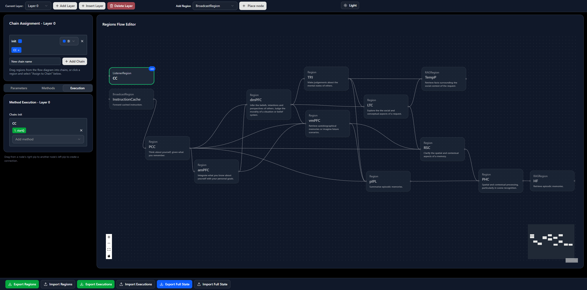
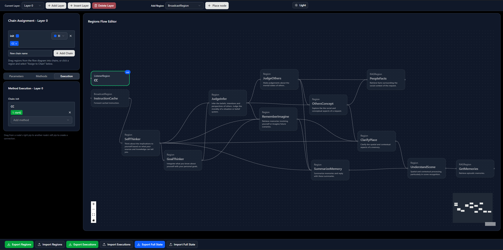

# Default Mode Network Workflow

This is a workflow simulating the human Default Mode Network (DMN). See [this review paper](https://doi.org/10.1016/j.neuron.2023.04.023) by Memon for an authoritative introduction. In brief, the DMN is involved in: 
>"self-reference, social cognition, episodic and autobiographical memory, language and semantic memory, and mind wandering"

*The DMN workflow, without name and task obfuscation*

## Motivation

Common end-user complaints around LLM usage involve a sense of system unaccountability, with sycophancy deployed as a substitute for meaningful engagement. Indeed, LLMs are usually incentivized in post-training to behave as helpful assistants, but not necessarily to understand responsibilities attendant to this role. This results in a jagged imitation of human behavior that creates repeated negative social expectancy violations for the user.

Successful communication requires assumptions to be made about the character of the receiver. I argue that humans assume  engagement with their messaging will involve contributions from a theory of self and an understanding of social dynamics. LLMs will sometimes output an assessment of motivation into their thinking trace (e.g., "The user is probably a... Who is looking for a..."). However, there are at least two issues with reliance on this as an enabling step toward socially aware responses:

1. Even in cases where a thinking model is deployed, it will not always produce a motivation analysis before each reply.
2. There is no guarantee that the model will remain faithful to its chain of thought. See [this paper](https://assets.anthropic.com/m/71876fabef0f0ed4/original/reasoning_models_paper.pdf) by Yanda *et al.* from the Anthropic Alignment Science Team.

One way to address this lack of socio-contextual attention may be to explicitly mimic the organizational and functional patterns attendant to human social introspection. This approach effectively breaks down the analysis of information into subtasks that enforce self-reference and social cognition.

## Modelling Objectives

The purpose of this demo is to recapitulate human introspective processes in the generation of a reply to a vague question. There are no prospectively defined objective measures of success or non-inferiority. The objectives are therefore entirely subjective and aesthetic.

The general hope was for the model to recall additional, incomplete details of the source text while making some (but not too many) mistakes, and to apply these 'memories' in an interesting and creative fashion. In effect, the purpose is to daydream for one iteration.

## What This Workflow is and is Not

This demo is not a representation of human consciousness. It is a simplified functional representation of the DMN. The neurological correlate of human consciousness is synchronized activity across a number of brain regions. This model shares some similarities with consciousness in that: 

- The model shows synchronized activity and message passing among a number of nodes. 
- These nodes are *functionally* defined and connected in a way that resembles one of the networks in the human brain.
- The nodes themselves are toy emulations of functional regions. 

However: 
- Connections are *highly* simplified.
- The activation pattern is *non-physiological*.
- A number of external inputs (i.e., salience and frontoparietal networks) are *completely absent*.
- Lateralization is *ignored*.

That being said, this model was fun to put together and produces pleasing outputs. I hope that you enjoy it!

## Design Considerations

Construction this workflow posed several challenges.

### Graph Selection

There is no single authoritative connectivity map of the DMN. The mapping that I chose represents my own best efforts to understand the DMN, its subnetworks and functional subunits. Moreover, the functional connectivity and temporal dynamics of the DMN are complex. I elected to focus mostly on strong connections.

### Functional Emulation

The nodes in this model exchange strings of text rather than influencing one another via synaptic connections. The separation of concerns in the Regions framework between 'reply' and 'request' message roles is therefore entirely artificial. So is the functional synchronization scheme.

A driving/synchronizing signal is propagated from higher regions to lower ones, followed by a content-rich return phase in the direction of the integrating regions. Memory editing at the level of the hippocampus is explicitly modelled through sequential use of the `request_summaries()` and `make_updates()` methods at the RAGRegion level, and may bear some crude analogy to hippocampal ripples. 

### Steering Inputs

These consist of region names, tasks and messages injected via the `external_input()` function prior to the main async call. Their content was arrived at through iterative prompt refinement informed by observations of deviant region behavior in the message trace.

An interesting issue had to be addressed in development. The LLMs picked up on the neuroscientific naming conventions of the nodes, and fed neuroscience questions down the system. This was most visible in an instance when the driving signal was not propagating down the network, but would recur in other situations where a region must run with an information-poor input.

To overcome this, task descriptions and region names were obfuscated.

*The DMN workflow, following name and task obfuscation*

| Obfuscated Name      | Unobfuscated Name |
|----------------------|-------------------|
| SelfThinker          | PCC               |
| GoalThinker          | amPFC             |
| JudgeInfer           | dmPFC             |
| RememberImagine      | vmPFC             |
| JudgeOthers          | TPJ               |
| SummarizeMemory      | pIPL              |
| OthersConcept        | LTC               |
| ClarifyPlace         | RSC               |
| UnderstandScene      | PHC               |
| PeopleFacts          | TempP             |
| GetMemories          | HF                |

Task descriptions were also edited to avoid neuroscientific jargon. Relating names with tasks and avoiding academic language helped the model function smoothly and reliably.

### Memory Management

Since chunking the entire life story of an individual into an SQLite database was not technically feasible, the poem "Madamme Proprietor" by Bardic Mechanism was used instead, with permission from the artist. The poem was manually pre-chunked and annotated with actor metadata. The resulting [document entries](dmn_test_entries.json) were used to populate the database. Similarity thresholds were kept low for retrieval operations, but kept high for consolidation. 

The low retrieval thresholds ensured that sufficient context was returned for the system to work with. The number of chunks was capped to an arbitrary 12 in order to keep subsequent operations focused. In contrast, high consolidation thresholds ensured that most summaries were rejected for consolidation, which is a desired behavior intended to prevent excessive memory editing.

### Initialization

This step presents a particular challenge, since there is no sensorium or salience network to prime DMN activity. The selected compromise was to use a vague, narrative request that presented disjointed concepts to be better recalled and reflected on. This text was injected to the attention of the PCC region along with its steering instructions. Only 'question' was injected as a request.
```python
    background = ("There were smells of smoke and paint, and patrons waiting. And Madamme "
                  "Proprietor. You recall this much. You need to learn more about the memory so "
                  "you can reply coherently when it is time to do so.")
    question = "What else do you remember happening, and what does it all mean?"
```
This is a purely artificial decision.

## Runtime

The workflow runs as shown in the graphics. Qwen3-235B-A22B-Thinking-2507 (Q2K_S), Qwen3-30B-A3B-Thinking-2507-GGUF (Q4_K_M) and Qwen3-4B-Thinking-2507 (Q6_K) were used to produce the sample results. Model assignments are quoted in the code below, with stronger models allocated to regions with more demanding tasks.
```python
    r['SelfThinker'].llm = llm_235b_a22b
    r['GoalThinker'].llm = llm_235b_a22b
    r['JudgeInfer'].llm = llm_235b_a22b
    r['JudgeOthers'].llm = llm_30b_a3b
    r['RememberImagine'].llm = llm_4b_a
    r['OthersConcept'].llm = llm_30b_a3b
    r['SummarizeMemory'].llm = llm_4b_a
    r['ClarifyPlace'].llm = llm_30b_a3b
    r['UnderstandScene'].llm = llm_4b_a
```
The final outputs were produced in a manner similar to the [double-Hegel demo](../double_hegel/README.md), with a detailed reply and summary generated.

## Results

The resulting message trace is presented in [dmn_trace.md](sample_results/dmn_trace.md). The JSON has been unescaped, but no redactions were made. The final replies with reference to the appropriate commit [dmn_inference.md](sample_results/dmn_inference.md).
