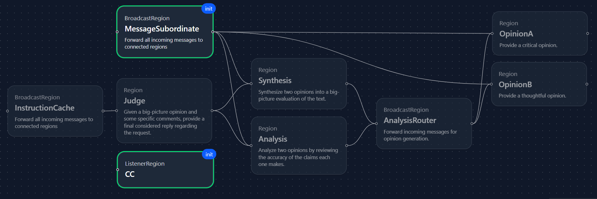

# Double Hegel Workflow

This is a workflow that applies the Hegel's dialectical method twice to a given notion and its context. Here is an illustration of progression through its layers:

The flow is supplied with a thesis and antithesis, from which it generates a synthesis. One antithesis of a synthesis is an analysis where the opposing arguments are broken into parts, and the parts then evaluated. Once the workflow has completed both synthesis and analysis, these components are sent to a final node for adjudication. This node returns a detailed reply, then writes a summary reply after itself summarizing the synthesis and analysis.

Here is the tabulated layer by layer progression, incorporating helper nodes:

| **Layer** | **Node**           | **Methods**        | **Notes**                                                                                    |
|-----------|--------------------|--------------------|----------------------------------------------------------------------------------------------|
| 0         | CC                 | `start()`          | Starts the ListenerRegion so that a message trace is generated.                              |
|           | MessageSubordinate | `broadcast()`      | Distributes injected source text to subordinate regions.                                     |
| 1         | Judge              | `make_questions()` | Primes 'Synthesis' and 'Analysis' regions for later replies.                                 |
| 2         | Synthesis          | `make_questions()` | Sends request for opinions via AnalysisRouter.                                               |
| 3         | Analysis           | `make_questions()` | Sends request for opinions via AnalysisRouter.                                               |
| 4         | AnalysisRouter     | `broadcast()`      | Forwards copies of all requests to both opinion generators. Replies will bypass this region. |
| 5         | OpinionA           | `make_replies()`   | Primed to be more critical. Should reply to at least two requests.                           |
|           | OpinionB           | `make_replies()`   | Primed to be critical, but less so. Should reply to at least two requests.                   |
| 6         | Synthesis          | `make_replies()`   | Receives opinions and uses them to reply to 'Judge'.                                         |
| 7         | Analysis           | `make_replies()`   | Receives opinions and uses them to reply to 'Judge'.                                         |
| 8         | Judge              | `make_replies()`   | Returns a detailed message based on replies from 'Synthesis' and 'Analysis'                  |
| 9         | InstructionCache   | `broadcast()`      | Since generating the message will have removed the original instruction, we resend it        |
|           | Judge              | `make_summaries()` | 'Judge' summarizes the replies it got. Requests are unaffected.                              |
|           | Judge              | `make_replies()`   | Returns a more concise message, now based on the summarized replies.                         |
| 10        | CC                 | `stop()`           | Stops the listener.                                                                          |

To furnish an example, this workflow was used to critique an earlier version of the [README.md](../../README.md) file at the root of the repository. The resulting message trace is presented in [readme_trace.md](sample_results/readme_trace.md). The JSON has been unescaped, and the original README.md payload redacted for brevity. The final critique with reference to the appropriate commit for the context can be found in [readme_crit.md](sample_results/readme_crit.md).